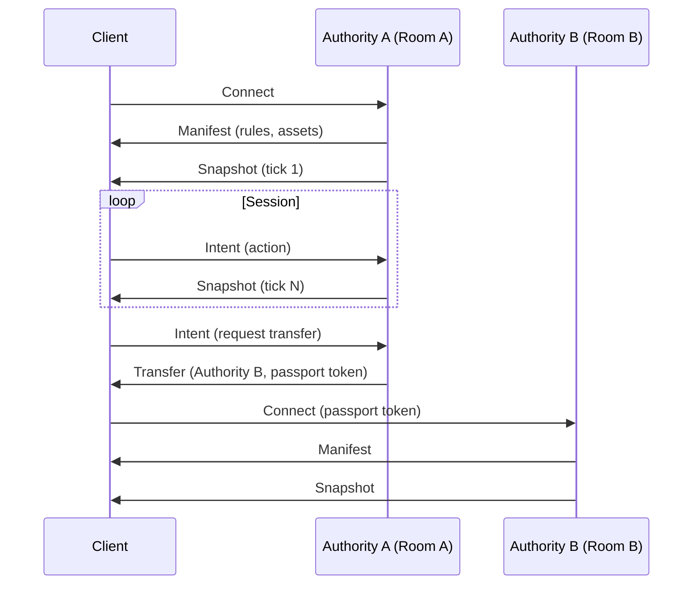

# Architecture

## Protocol Flow



## Message Types

### Manifest

Sent by authority on connection. Describes what this room allows:

```rust
struct Manifest {
    room_id: RoomId,
    substrate_hash: Hash,      // Content address of static room definition
    capabilities: Vec<CapabilityId>,
    asset_requirements: Vec<AssetRef>,
}
```

### Intent

Client requests an action:

```rust
enum Intent {
    // Examples — your application defines what intents exist
    Perform { action: ActionId, target: Option<TargetId> },
    Send { channel: ChannelId, message: String },
    // Application-specific intents are opaque bytes to the protocol
}
```

### Snapshot

Authority broadcasts authoritative state:

```rust
struct Snapshot {
    tick: u64,
    state: Vec<StateEntry>,
    events: Vec<RoomEvent>,
}
```

### Transfer

Authority hands off client to another authority:

```rust
struct Transfer {
    destination: AuthorityAddress,
    passport: Passport,
    signature: Signature,
}
```

## Substrate Caching

Substrates are content-addressed and aggressively cached:

1. Client connects to Authority A
2. Authority sends `substrate_hash`
3. Client checks local cache
4. If miss, fetches from authority or P2P
5. Verifies hash

When Authority A dies, client still has substrate locally.

## Heartbeat Snapshots

Authorities periodically export simulation state as new substrate versions:

1. Every N minutes, export "state of the room"
2. Push to replication layer (IPFS, S3, P2P mesh)
3. If authority crashes, reconnecting clients load latest snapshot
4. User-created changes persist (as static objects)
