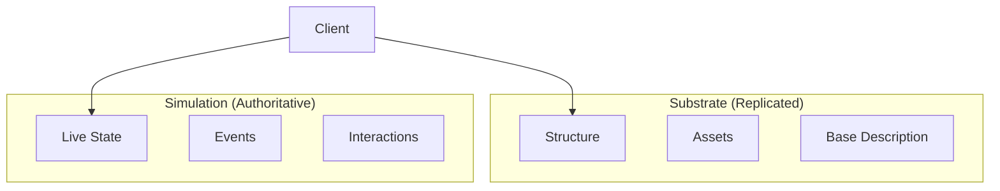

# Introduction

Interconnect is a connective substrate — the protocol layer that lets clients connect to authorities. A room is anything with an owner that accepts connections: a game world, a social feed, a running process, an autonomous agent. The protocol is transport-agnostic: WebSocket, Unix socket, Discord bot, HTTP — it doesn't care how messages move, only what they mean.

## The Problem with State Merging

Traditional federation protocols (like Matrix) try to merge state from multiple servers. This creates attack surfaces:

- **State Resolution DoS**: Craft complex conflicting events to burn CPU
- **History Rewriting**: Inject fake events into the past
- **Split-Brain Attacks**: Partition network, create conflicting realities, merge chaos

## The Interconnect Solution

Don't merge. Switch.

- Authority A owns Room X
- Authority B owns Room Y
- When you're in Room X, Authority A decides what happens
- When you move to Room Y, you disconnect from A and connect to B

**Authority, not consensus.** No state merging, no distributed state.

## Two-Layer Architecture

### Substrate

The static definition of the room:
- Structure, assets, base description
- Content-addressable (like IPFS)
- Cacheable everywhere
- Survives authority loss

What "structure" means depends on the room. For a game: geometry and textures. For a social feed: post history. For an agent: session context and configuration.

### Simulation

The live state of the room:
- Current state, active interactions, events
- Authoritative from single authority
- Not replicated
- Pauses when authority is lost

### Ghost Mode

When you lose connection to the authority:

1. Client knows authority is unreachable
2. You become an observer
3. Substrate remains available (read-only)
4. Can't interact (no simulation)
5. Room didn't disappear; it paused

## Next Steps

- [Use Cases](/use-cases) - Virtual worlds, social platforms, and more
- [Design Decisions](/design-decisions) - Architectural choices and rationale
- [Architecture](/architecture) - Detailed system design
- [Protocol Reference](/protocol) - Message formats
- [Security Model](/security) - Attack surface analysis
